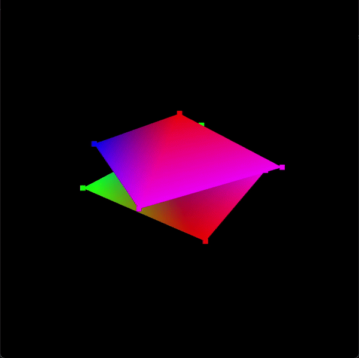

# Dynamic Pyramid: A Captivating 3D Experience

Welcome to Dynamic Pyramid, an OpenGL project that renders a rotating pyramid atop a fixed plane. This project aims to provide an immersive 3D experience using the power of OpenGL.

## Features

- Real-time rendering of a 3D pyramid and a fixed plane.
- Smooth rotation of the pyramid for an engaging visual effect.
- Customizable parameters such as pyramid size, rotation speed, and color.
- Simple and intuitive controls to interact with the scene.

## Prerequisites

Before running the project, ensure that you have the following prerequisites installed on your system:

- C++ compiler that supports C++11 or higher.
- OpenGL libraries and headers.

## Contributions

Contributions to Dynamic Pyramid are welcome! If you find any issues or have suggestions for improvements, feel free to open an issue or submit a pull request. Let's make this project even more amazing together!

## Credits

This project was created by Bouali Kassem Anis as part of the Computer Graphics Course/Subject, @the Faculty of Informatics, University of Debrecen.

## License

This project is licensed under the [MIT License](https://opensource.org/licenses/MIT).

